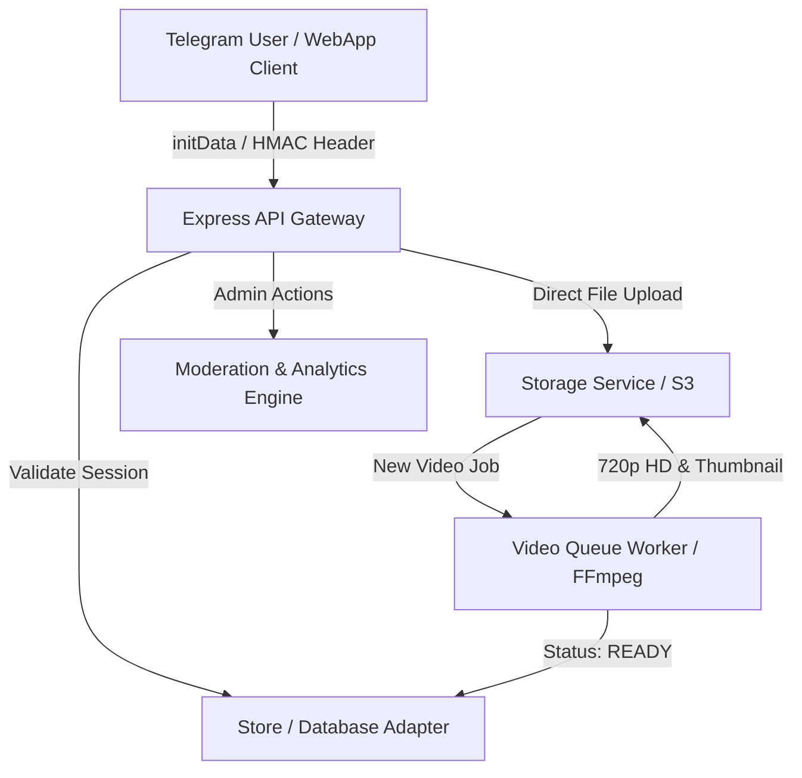
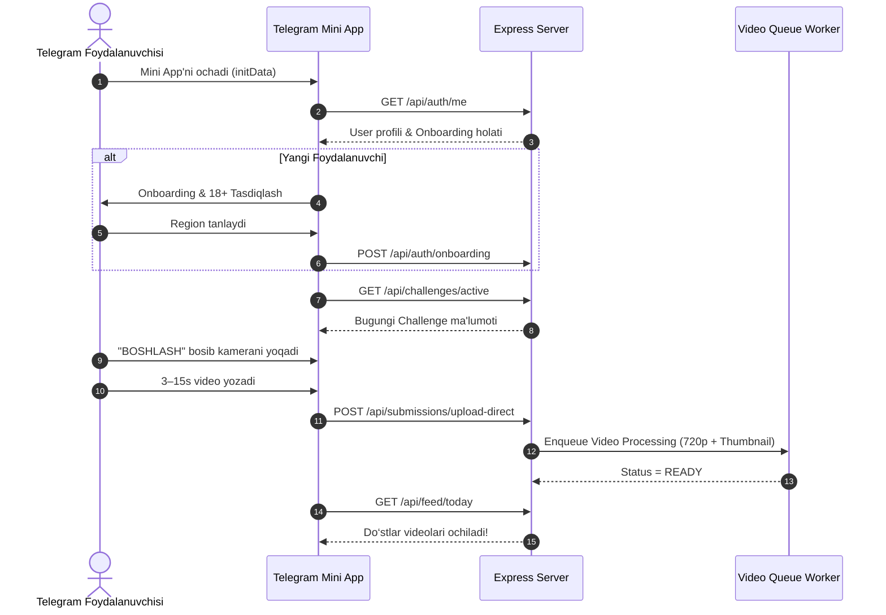

# QANI? - Telegram Mini App Platform MVP

> **Slogan:** *“Gap bilan emas, kamerada ko‘rsat.”*

QANI? — O‘zbekiston bozori uchun mo‘ljallangan, kunlik qiziqarli video topshiriqlarni kamerada yozib bajarish va do‘stlar bilan raqobatlashish imkonini beruvchi **Telegram Mini App** platformasining to‘liq ishlaydigan MVP versiyasi.

---

## 🌟 Asosiy Imkoniyatlar & Oqim

1. **Telegram Autentifikatsiya & HMAC Tekshiruvi**:
   - Backend Telegram `initData` ma'lumotlarini Bot Token orqali HMAC-SHA256 yordamida tekshiradi.
   - Dev vaqtida Telegram brauzersiz test qilish uchun **Dev Mock Auth** rejimi (header va UI switch orqali) sozlangan.
2. **Onboarding & Qoidalar**:
   - 3 ta asosiy qoida tushuntiriladi.
   - 18 yoshdan katta ekanligi va O‘zbekiston viloyati/shahri tanlanadi (GPS olinmaydi).
3. **Kunlik Challenge Engine (Asia/Tashkent)**:
   - Toshkent vaqt zonasi bo‘yicha har kuni yangi kamera topshirig‘i e’lon qilinadi.
   - Taymer va ko‘rsatmalar beriladi.
4. **In-App Kamera & Video Yozish**:
   - HTML5 `MediaRecorder` orqali 3–15 soniyalik video olinadi. Front/rear kamera almashtiriladi.
   - WebRTC ruxsati berilmagan WebView'lar uchun xavfsiz fayl yuklash fallback tizimi mavjud.
5. **Video Queue & Optimallashtirish**:
   - Video yuborilgach, background queue worker uni 720p HD formatiga optimallashtiradi va avtomatik JPEG thumbnail yaratadi.
6. **Do‘stlar Feed'i & Bloklash Qoidasi**:
   - Foydalanuvchi o‘z videosini yubormaguncha do‘stlarining bugungi videolarini ko‘ra olmaydi ("O‘zing bajarmaguncha boshqalarniki yopiq").
   - Autoplay, audio boshqaruvi va ijobiy reaksiyalar (`😂`, `🔥`, `👏`, `❤️`).
7. **Referral Deep-Link & Guruhlar**:
   - Telegram `startapp` orqali unikal taklif havolalari.
   - Shaxsiy private guruhlar yaratish va a'zolarning kunlik topshiriq bajarish progressini kuzatish.
8. **Admin Panel & Moderatsiya**:
   - Challenge yaratish, tahrirlash va rejalashtirish.
   - Report qilingan videolarni tasdiqlash, rad etish, o‘chirish yoki qoidabuzarni bloklash.

---

## 🏗️ Arxitektura Diagrammasi (Mermaid)



---

## 🔄 User Flow Diagrammasi (Mermaid)



---

## 🛠️ Qanday Qilib Lokal Ishga Tushiriladi?

### 1-Usul: Bitta buyruq bilan (Node / Express + Vite)
```bash
npm install
npm run dev
```
Dastur `http://localhost:3000` manzilida ishga tushadi.

### 2-Usul: Docker Compose orqali (PostgreSQL + Redis + MinIO + Web + Worker)
```bash
docker-compose up --build
```

---

## 🔒 Xavfsizlik Checklist

- [x] **Telegram HMAC Hash verification**: Bot Token serverda saqlanadi, initData imzosi tekshiriladi.
- [x] **Strict Input Validation**: Barcha API so‘rovlari `Zod` sxemasi orqali tekshiriladi.
- [x] **Direct Storage Upload**: Video fayllar API serverini ortiqcha yuklamaydi.
- [x] **Rate Limiting**: `express-rate-limit` sozlangan.
- [x] **No Hardcoded Secrets**: Barcha maxfiy kalitlar `.env` orqali boshqariladi.

---

## 🤖 Telegram Bot & Mini App Boshlang'ich Sozlash Hujjati

1. Telegram'da **@BotFather** botini oching.
2. `/newbot` buyrug'i orqali yangi bot yarating va `TELEGRAM_BOT_TOKEN` kalitini oling.
3. `/newapp` buyrug'i orqali Web App yarating.
4. Web App URL manziliga joylashtirilgan Cloud Run yoki Vercel havolasini kiriting (`https://your-domain.com`).
5. Bot menyusiga "QANI?ni ochish" tugmasini kiriting:
   `/setmenu-button` -> Web App URL -> `https://your-domain.com`.

---

## 🚀 Ishlab Chiqilgan Fayllar & Loyiha Tuzilishi

- `DECISIONS.md`: Barcha texnik qarorlar va sabablar
- `TODO_AFTER_MVP.md`: Post-MVP rejalar
- `prisma/schema.prisma`: PostgreSQL ma'lumotlar bazasi modeli
- `prisma/migrations/`: Baza migration SQL fayllari
- `prisma/seed.ts`: Boshlang'ich test ma'lumotlari
- `server.ts`: Express API backend serveri
- `src/App.tsx`: React Telegram Mini App asosi
